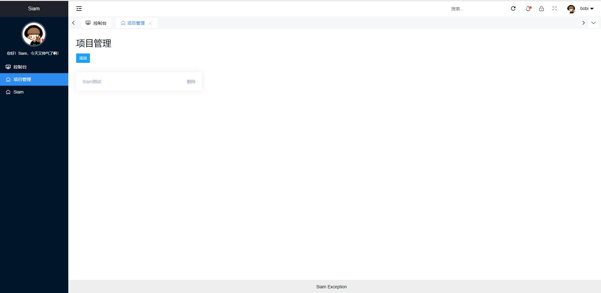
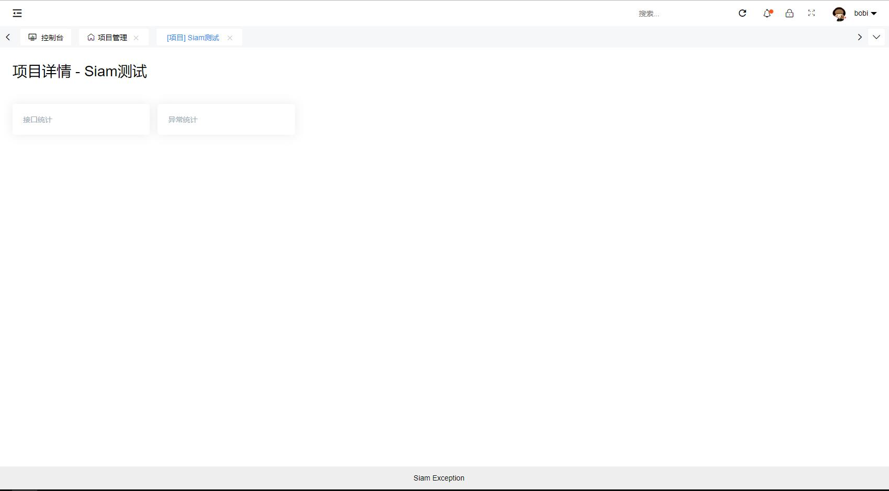
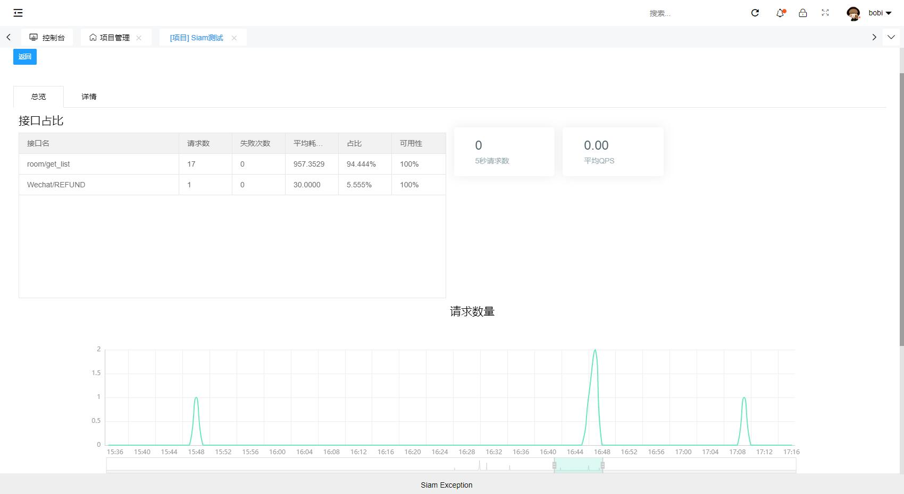
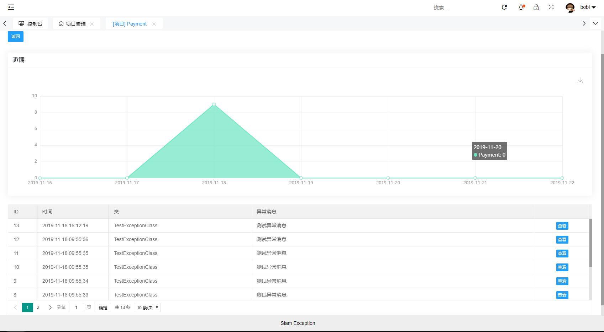

Siam Project Manage
===============


致敬其他开源项目

- Thinkphp 6.0
- ok-admin UI
- guzzle

等等

# 功能介绍

SPM，自己工作过程中需求，顺便整理开源，作为一个中间统计平台，可以快速分析API频率、可用性等；记录程序异常参数和原因、快速复原崩溃过程、定位程序bug；管理项目事务（任务安排、规划）；日志储存，使用唯一标识储存（如订单号）、指定查询。

个人负责项目较多，每个项目都写一遍这些模块有点累人，于是写了这个统计平台。

其他项目通过HTTP、UDP、直连数据库等方式上报数据，日常管理只需要从SPM平台查看数据。

# 截图预览









其他待完成...

# 安装

- clone 此git仓库到本地，php环境指向public目录，Thinkphp6.0(建议先看框架文档)
  xp面板配置目录域名对应到public目录，否则在域名后面还要拼接/apm/public/
- 前端页面为 ```www.root.com/UI/index.html```
- 修改前端配置文件 ```/UI/lib/layui/lay/okmodules/siamConfig.js```文件
- - url  api 路径  为以上部署域名指定 ```www.root.com/index.php```
- - isFrontendBackendSeparate 是否前后分离 默认true
- 导入根目录/database.sql到mysql数据库中
- 修改Thinkphp程序数据库配置文件   copy根目录的.example.env  命名为.env 并且修改其中的配置项
- 运行`composer install` 安装php组件依赖（建议切换国内镜像安装，速度比较快）
    composer require topthink/think-multi-app

# 常见问题
Q0: 控制器不存在 app\controller\Api
为什么提示 “控制器不存在:app\controller\Api”？
因为安装多应用模式扩展执行的指令没有生效 php think service:discover 自动注册扩展包的系统服务。
为什么自动注册拓展包服务失败，详见代码：
vendor/topthink/framework/src/think/console/command/ServiceDiscover.php
第34行代码$package['extra']['think']['services']为空，导致生成自动注册服务文件
services.php 中没有注册的代码。
天坑！
怎么解决呢？
首先找到你加入的拓展，在这里：
vendor/composer/installed.json
然后把所有的$package['extra']['think']['services']复制粘贴到services中，
复制vendor/composer/installed.json中的services值到vender/services的数组中。
以下文件的代码是读取services的地方。：
vendor/topthink/framework/src/think/console/command/ServiceDiscover.php


Q1: 上报到统计平台不是会影响速率吗？

A1: 
- 统计平台与项目部署在同一个内网里，然后机器hosts指定统计平台域名为127.0.0.1
- 后续可以采用UDP 或者直连数据库插入 等方式，会比HTTP更优
- 肯定会有一些多余的损耗，性能损耗和工作便利 二择其一

Q2: 统计平台的域名需要真实的吗？

A2:

不需要真实域名，如我个人使用的是`test.statistics.com` 服务器本地hosts指定127即可。

然后在个人电脑上也同样更改hosts，域名指定为服务器地址，即可查看后台。

如果阿里云、腾讯云备案拦截，可以将域名设置为www.qq.com等其他，然后指定hosts即可。

Q3: 怎么快速上报，有没有封装SDK？

A3:

有的，php版本为以下地址sdk，可使用composer安装

https://github.com/xuanyanwow/spm-sdk


niginx 加个代理
访问http://xxx.xx/apm即
server{
  ...
  /apm/{
    proxy_pass http://127.0.0.1/apm/public/;
  }
}
上报接口文档
如果域名不是对应public目录而是根目录，还要加域名/apm/public/

http://域名/api/console/get_data 获取数据

http://域名/index.php/api/project/get_list'
添加项目
http://域名/index.php/api/project/add'
POST: project_name=项目名'

http://localhost/index.php/api/abnormal/get_static

http://localhost/index.php/api/abnormal/get_list?page=1&limit=10&project_id=4